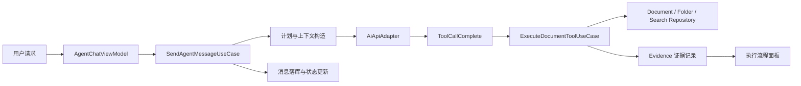
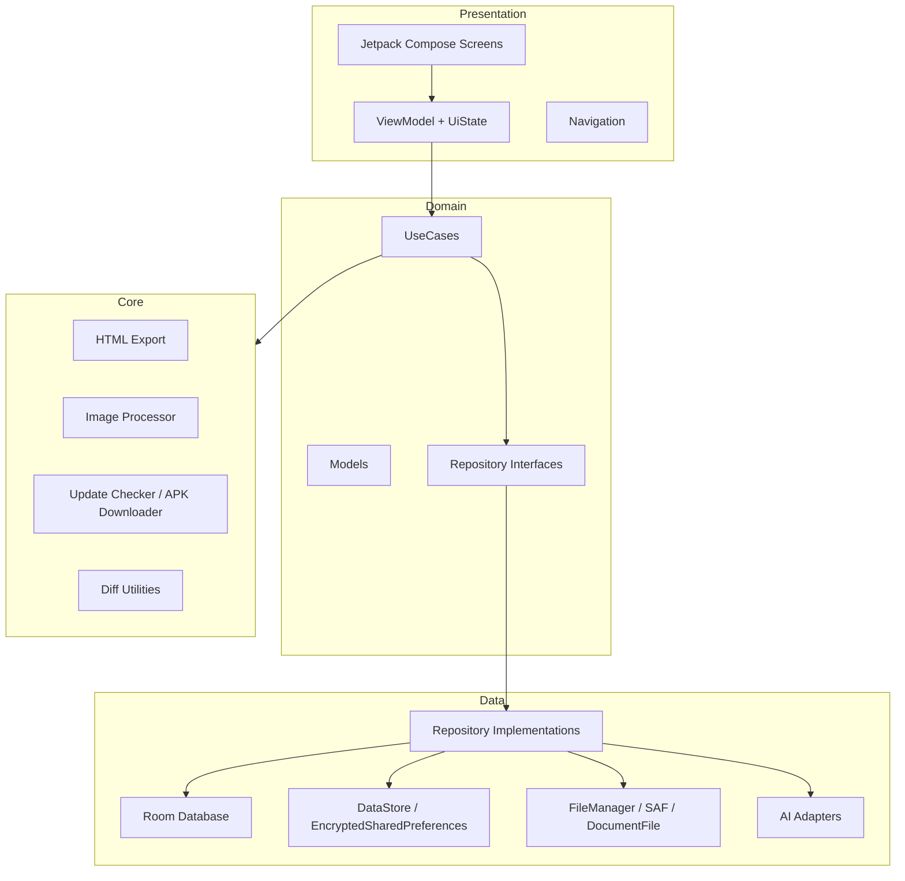
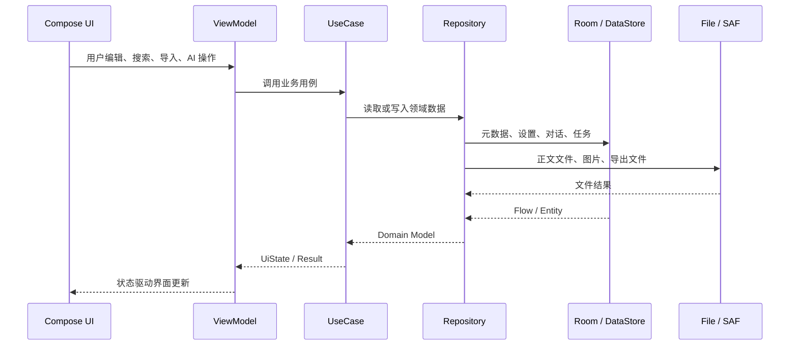

<p align="center">
  
</p>

<h1 align="center">YuMark</h1>

<p align="center">
  <strong>面向 Android 的 AI Native Markdown 工作台</strong>
</p>

<p align="center">
  从本地笔记、外部文件夹、实时预览，到多模型 AI 助手与 Agent 文档自动化，YuMark 希望把手机上的 Markdown 写作体验做得足够安静、强大、可信赖。
</p>

<p align="center">
  <a href="https://github.com/ban-code-art/YuMark/releases"></a>
  
  
  
  
</p>

<p align="center">
  <a href="#功能全景">功能全景</a>
  ·
  <a href="#ai-与-agent">AI 与 Agent</a>
  ·
  <a href="#技术架构">技术架构</a>
  ·
  <a href="#快速开始">快速开始</a>
  ·
  <a href="#发布与安全">发布与安全</a>
</p>

---

## 项目定位

YuMark 是一款 Android Markdown 编辑器，也是一套围绕“移动端写作、知识管理、AI 协作”的完整实验场。

它不是单纯的文本输入框。YuMark 同时管理本地文档库、外部文件夹工作区、Markdown 渲染、导入导出、主题设置、自动更新、AI 对话、Agent 执行流程和工具调用证据。应用的核心目标是让用户可以在手机上完成从记录、整理、阅读、重写到自动化处理文档的完整闭环。

| 方向 | YuMark 解决的问题 |
| --- | --- |
| 移动写作 | 在 Android 上提供接近桌面 Markdown 编辑器的沉浸式书写与预览体验 |
| 本地优先 | 文档正文、设置、对话、任务和附件都优先落在本机，避免依赖云端工作流 |
| AI 协作 | 支持普通聊天、选中文本快捷处理、Agent 文档工具调用和多模态图片输入 |
| 可维护工程 | 使用 Kotlin、Compose、Room、DataStore、Hilt、Ktor 和分层架构组织代码 |
| 可发布产品 | 支持 release 签名、APK 发布、更新检查、GitHub Release 分发和安全配置隔离 |

## 下载体验

最新版本：`v0.7`<br>
Android 要求：`Android 8.0+`，`minSdk 26`<br>
发布页：[YuMark Releases](https://github.com/ban-code-art/YuMark/releases)

| 资产 | 说明 |
| --- | --- |
| `YuMark-v0.7.apk` | 当前正式 APK，作为 GitHub Release 附件发布 |
| `RELEASE_NOTES_v0.7.md` | v0.7 详细更新说明，包含 Agent 稳定性、AI 多模态、WebView 生命周期和安全发布调整 |
| SHA256 | `f661a31de9c996dffb94b661abb689c09a146a95e0318a1c67622c789547c876` |

> APK 不再放入 git 源码历史。源码仓库只保存代码、文档和构建脚本，发布包通过 GitHub Release 管理。

## 应用截图

<p align="center">
  
  
  
</p>

<p align="center">
  
  
  
</p>

| 画面 | 说明 |
| --- | --- |
| 文档列表 | 本地文档库入口，支持搜索、排序、文件夹组织和导入 |
| 编辑模式 | Markdown 原文编辑，底部工具栏快速插入常用语法 |
| 预览模式 | WebView 渲染 Markdown，支持公式、代码高亮、图表和图片 |
| 文件树侧栏 | 展示库内目录或外部工作区结构，适合长项目浏览 |
| 大纲导航 | 由渲染页回传标题结构，点击标题快速定位 |
| 设置页面 | 主题、字体、自动保存、图片压缩、默认目录和 AI 配置入口 |

## 功能全景

### 1. Markdown 写作与阅读

YuMark 的编辑器围绕“写得快、看得清、切换稳”设计。编辑态专注输入，预览态专注阅读，二者之间通过滚动比例同步和渲染就绪握手减少跳动。

| 能力 | 细节 |
| --- | --- |
| Markdown 原文编辑 | 支持标题、列表、引用、链接、代码块、表格等常用语法 |
| 快捷工具栏 | 底部 Markdown Toolbar 快速插入标题、加粗、斜体、链接、代码、表格等片段 |
| 实时渲染预览 | 使用 WebView 加载本地渲染模板，Base64 通道传递正文，降低转义问题 |
| 滚动同步 | 编辑态和预览态按比例保存与恢复滚动位置，长文档切换更稳定 |
| 大纲提取 | 渲染页扫描标题结构并回传 Android，右侧大纲支持点击定位 |
| 选中文本 AI | 编辑态和预览态都可围绕选中文本唤起 AI 助手，适合润色、解释、改写 |
| 自动保存 | 可配置自动保存，降低移动端切后台或误触造成的内容丢失 |
| 外部更新热刷新 | Agent 或外部流程修改文档后，编辑器可重新加载当前内容 |

### 2. 高级 Markdown 渲染

YuMark 的 Markdown 渲染不是简单把文本转 HTML，而是针对移动端 WebView 做了分阶段处理。

| 渲染能力 | 实现方式 |
| --- | --- |
| GFM Markdown | `marked.js`，启用 `gfm` 和换行处理 |
| 数学公式 | `KaTeX`，在 Markdown 解析前保护公式占位，避免下划线、反斜杠被错误解析 |
| 代码高亮 | `Prism.js`，渲染后对代码块执行高亮 |
| Mermaid 图表 | `Mermaid` 延迟渲染，避免影响首屏体验 |
| 表格 | GFM 表格样式，移动端可读性优化 |
| 图片解析 | 支持库内导入资源和 SAF 外部工作区资源的相对路径解析 |
| 代码块交互 | 优化横向滚动，减少长代码块影响整页滚动 |
| 主题适配 | 渲染页背景色与 Compose 主题同步，保留 WebView 硬件加速滚动性能 |

### 3. 文档库与文件夹管理

应用内文档库使用 Room 保存元数据，正文落本地文件系统。这样可以保留文件级可迁移性，同时让搜索、排序、文件夹树和设置有稳定的数据模型。

| 能力 | 说明 |
| --- | --- |
| 本地文档库 | 文档标题、文件夹、字数、时间等元数据由 Room 管理 |
| 文件夹组织 | 支持文件夹树、移动、根目录高亮和目录级管理 |
| 搜索 | 支持按标题和正文内容搜索，搜索逻辑在 IO 调度执行 |
| 排序 | 支持按名称、更新时间、创建时间、字数等维度排序 |
| 原子写入 | 文件保存使用临时文件加 rename，降低异常中断导致正文损坏的概率 |
| 安全兜底 | enum 反序列化和历史数据读取增加默认值兜底，降低升级崩溃风险 |

### 4. 外部工作区

YuMark 支持通过 Android SAF 打开外部文件夹，直接浏览和编辑真实文件系统中的 Markdown 文档。

| 工作区能力 | 说明 |
| --- | --- |
| SAF 授权 | 使用系统文件选择器授予目录访问权限 |
| 文件树扫描 | `WorkspaceScanner` 将外部目录扫描为 `WorkspaceNode` 树 |
| 会话恢复 | DataStore 保存上次工作区 URI，应用启动后尝试恢复 |
| 默认目录 | 可设置默认目录，减少每次打开文件夹的重复操作 |
| 外部文档编辑 | 支持通过 `docUri` 打开外部 Markdown 文档 |
| 相对图片 | 对外部工作区图片路径做 URI 拼接和编码处理 |

### 5. 导入、导出与资源处理

| 类型 | 当前状态 |
| --- | --- |
| Markdown 导出 | 已支持，导出原始 `.md` 文件 |
| HTML 导出 | 已支持，基于 CommonMark 生成完整 HTML |
| PDF 导出 | 已规划，预留 Android Print API 实现入口 |
| Word 导出 | 已规划，当前接口保留但未实现 |
| 图片导出 | 已规划，当前接口保留但未实现 |
| 图片压缩 | 导入图片支持尺寸探测和 `inSampleSize` 下采样 |
| AI 附件 | Agent 图片附件会校验、压缩并存入应用私有目录 |

### 6. 更新检查与发布包

YuMark 内置更新检查与 APK 下载相关能力，适合 GitHub Release 分发模式。

| 能力 | 说明 |
| --- | --- |
| 更新检查 | 通过远程 release 信息判断是否有新版本 |
| APK 下载 | Ktor 流式下载到 App 外部私有目录 |
| 安装流程 | 保留 `REQUEST_INSTALL_PACKAGES` 权限以支持自更新场景 |
| Release 产物 | APK 以 GitHub Release Asset 发布，源码仓库不追踪 APK |

## AI 与 Agent

YuMark 的 AI 不是单一聊天窗口，而是拆成三层体验：普通对话、编辑器快捷 AI、Agent 文档自动化。

### AI 模式矩阵

| 模式 | 适合场景 | 能力边界 |
| --- | --- | --- |
| 普通聊天 | 解释概念、生成草稿、讨论写作思路 | 不直接修改文档 |
| 快捷 AI | 对当前文档或选中文本提问、润色、改写 | 与编辑器上下文绑定 |
| Agent | 规划任务、读取文档、搜索项目、创建或编辑文档 | 可通过工具调用产生文档操作 |

### 支持的模型 Provider

| Provider | 用途 |
| --- | --- |
| OpenAI 官方 | 默认 OpenAI API 格式 |
| OpenAI Compatible | 兼容 DeepSeek、Ollama、本地 vLLM 等 OpenAI 风格接口 |
| Claude | Anthropic Claude API |
| Gemini | Google Gemini API，API key 使用请求头传递 |

API Key 使用 AndroidX Security Crypto 存储，非敏感配置使用 DataStore 保存。AI 配置页支持 Provider、Base URL、模型名和开关管理。

### Agent Runtime

Agent 是 YuMark 最有辨识度的能力之一。它不只是把模型回复显示出来，而是把一次复杂请求拆成可观察、可终止、可审计的任务流。



| Agent 能力 | 说明 |
| --- | --- |
| 任务生命周期 | `EXECUTING`、`COMPLETED`、`FAILED`、`CANCELLED`、`BLOCKED` 等状态持久化 |
| 执行流程面板 | 展示步骤、状态、阻塞原因、最终摘要和工具调用痕迹 |
| 可取消 | 停止流式响应时会同步更新任务终态，避免卡在执行中 |
| 工具调用累积 | 一轮响应中的多个工具调用会累积处理，避免被后续调用覆盖 |
| 证据记录 | 工具执行结果写入 evidence，便于用户回看 Agent 做了什么 |
| 折叠偏好 | Agent 面板折叠状态通过 DataStore 持久化 |
| 多模态附件 | Agent 支持最多 3 张图片附件，经压缩后传给视觉模型 |

### 文档工具

Agent 使用结构化工具访问文档上下文。工具 schema 与解析逻辑由测试守护，减少模型输出字段漂移造成的执行错误。

| 工具方向 | 典型能力 |
| --- | --- |
| 读取文档 | 按文档 ID 读取正文，为回答和编辑提供上下文 |
| 搜索项目 | 在当前文档库中搜索关键词，返回候选文档 |
| 创建文档 | 根据模型输出创建新文档 |
| 编辑文档 | 对当前或指定文档生成新内容，并进入操作确认流程 |
| 证据关联 | 每次工具调用保留来源工具、输入摘要和结果摘要 |

### AI 消息渲染

AI 回复同样使用 Markdown 渲染，但针对聊天流式输出做了轻量优化。

| 问题 | 处理 |
| --- | --- |
| 流式输出频繁刷新 | 按固定间隔合并渲染，避免 WebView 整块闪烁 |
| 长会话 WebView 累积 | Compose 释放时销毁 WebView 并清理 JS interface |
| 代码和表格可读性 | AI 消息支持标题、列表、代码块、表格、引用等基础 Markdown |

## 技术架构

YuMark 采用 Clean Architecture + MVVM。代码按表现层、领域层、数据层和基础设施能力拆分，核心业务通过 UseCase 组织，Repository 接口定义在 domain，具体实现放在 data。



### 分层职责

| 层级 | 主要内容 | 代表文件 |
| --- | --- | --- |
| Presentation | 页面、组件、状态收集、用户交互 | `EditorScreen.kt`、`FileListScreen.kt`、`AgentChatSheet.kt` |
| Domain | 领域模型、Repository 接口、UseCase | `Document.kt`、`AgentUseCases.kt`、`ExportDocumentUseCase.kt` |
| Data | Room、DataStore、AI Adapter、Repository 实现 | `AppDatabase.kt`、`AiConfigDataStore.kt`、`OpenAiAdapter.kt` |
| Core | 导出、图片处理、更新下载、diff、校验 | `HtmlExporter.kt`、`ImageProcessor.kt`、`ApkDownloader.kt` |
| DI | 依赖注入模块 | `DatabaseModule.kt`、`RepositoryModule.kt`、`NetworkModule.kt` |

### 数据流



## 技术栈

| 分类 | 技术 |
| --- | --- |
| 语言 | Kotlin 1.9.22 |
| 构建 | Gradle Wrapper + Android Gradle Plugin 8.2.2 |
| UI | Jetpack Compose、Material 3、Navigation Compose |
| 状态 | ViewModel、StateFlow、Lifecycle Runtime Compose |
| 异步 | Kotlin Coroutines、Flow |
| 依赖注入 | Hilt 2.50 |
| 数据库 | Room 2.6.1，导出 schema |
| 设置存储 | DataStore Preferences |
| 敏感配置 | AndroidX Security Crypto |
| 文件系统 | Android SAF、DocumentFile、应用私有目录 |
| 网络 | Ktor Client Android、Content Negotiation、Kotlinx Serialization |
| Markdown 预览 | WebView、marked.js、KaTeX、Prism.js、Mermaid |
| Markdown 导出 | CommonMark、GFM Tables、Strikethrough、Task List Items |
| 图片 | Coil Compose、BitmapFactory 下采样、压缩配置 |
| 测试 | JUnit 5、MockK、Truth、Turbine、Coroutines Test |

## 项目结构

```text
YuMark/
├── app/
│   ├── build.gradle.kts
│   ├── schemas/                         # Room schema
│   └── src/
│       ├── main/
│       │   ├── assets/                  # Markdown 渲染模板与 JS/CSS 资源
│       │   ├── java/com/yumark/app/
│       │   │   ├── core/                # 导出、图片、更新、工具能力
│       │   │   ├── data/                # Room、DataStore、Repository、AI Adapter
│       │   │   ├── di/                  # Hilt 模块
│       │   │   ├── domain/              # Model、Repository 接口、UseCase
│       │   │   └── presentation/        # Compose UI、ViewModel、主题和导航
│       │   └── res/
│       └── test/                        # 单元测试与回归测试
├── docs/                                # 设计文档、修复记录、截图资源
├── gradle/libs.versions.toml            # 版本集中管理
├── RELEASE_NOTES_v0.7.md                # 当前版本更新说明
└── README.md
```

### 关键模块速览

| 模块 | 说明 |
| --- | --- |
| `presentation/editor` | 编辑器主界面、Markdown Toolbar、AI 快捷入口、预览 WebView 管理 |
| `presentation/ai` | AI 聊天、Agent 面板、对话列表、状态指示器、diff 展示 |
| `domain/usecase/ai` | AI 配置、聊天发送、Agent runtime、文档工具和搜索排序 |
| `data/ai/adapters` | OpenAI、Claude、Gemini、OpenAI Compatible 的协议适配 |
| `data/local/db` | Room database、DAO、Entity、Migration |
| `data/local/prefs` | Settings、Workspace、AI Config、Agent UI 偏好 |
| `data/local/file` | 文档正文、导入资源、外部工作区扫描 |
| `core/export` | CommonMark HTML 导出 |
| `core/image` | AI 附件与图片压缩处理 |
| `core/update` | APK 下载与更新流程支撑 |

## 质量与测试

YuMark 的测试重点覆盖领域逻辑、AI 工具调用、Agent 状态机、数据映射、图片处理、搜索和 ViewModel 行为。

| 测试方向 | 示例 |
| --- | --- |
| AI Adapter | 多模态消息、工具调用格式、流式重试、取消异常 |
| Agent Runtime | 任务规划、工具执行、阻塞状态、终态写入、ViewModel 状态映射 |
| 文档工具 | `create_document`、`edit_document` schema 与 parser 字段一致性 |
| 数据层 | Room mapper、DocumentRepository 搜索、AgentTaskRepository |
| 编辑器 | 外部文档加载、AI 应用修改、导出状态 |
| 主题 | 主题 ID 回退、主题列表顺序 |
| 网络配置 | AI client timeout 使用 Ktor infinite marker，避免非法 0 timeout |

常用验证命令：

```bash
# 完整检查：lint + unit test + debug/release check
./gradlew :app:check --continue

# Debug 单元测试
./gradlew :app:testDebugUnitTest

# Release 构建
./gradlew :app:assembleRelease
```

Windows:

```powershell
cmd /c gradlew.bat :app:check --continue
cmd /c gradlew.bat :app:assembleRelease
```

## 快速开始

### 环境要求

| 依赖 | 版本 |
| --- | --- |
| JDK | 17+ |
| Android Studio | Hedgehog 2023.1.1 或更高版本 |
| Android SDK | compileSdk 34，targetSdk 34 |
| 最低系统 | Android 8.0，minSdk 26 |

### 克隆项目

```bash
git clone https://github.com/ban-code-art/YuMark.git
cd YuMark
```

### 构建 Debug APK

```bash
./gradlew :app:assembleDebug
```

Windows:

```powershell
cmd /c gradlew.bat :app:assembleDebug
```

产物路径：

```text
app/build/outputs/apk/debug/app-debug.apk
```

### 安装到设备

```bash
adb install app/build/outputs/apk/debug/app-debug.apk
```

### 构建 Release APK

Release 构建需要本地签名配置。复制模板：

```bash
cp keystore.properties.example keystore.properties
```

填写本机 keystore 信息：

```properties
storeFile=../release.keystore
storePassword=
keyAlias=
keyPassword=
```

然后执行：

```bash
./gradlew :app:assembleRelease
```

> `keystore.properties`、`release.keystore`、`*.apk` 和 `*.aab` 均被 `.gitignore` 忽略，不应提交到源码仓库。

## 发布与安全

| 项目 | 当前策略 |
| --- | --- |
| 签名配置 | Release 签名从本地 `keystore.properties` 读取，构建脚本不硬编码密码 |
| 敏感文件 | `keystore.properties`、`release.keystore`、`local.properties` 不入库 |
| APK 管理 | APK 作为 GitHub Release Asset 发布，不放入 git 历史 |
| AI Key | AndroidX Security Crypto 存储 API key |
| 网络 timeout | AI 流式请求使用 Ktor infinite request timeout marker，socket timeout 管理空闲长连接 |
| WebView 生命周期 | Compose 释放时销毁 WebView，清理 JS interface |

安全提醒：

- 旧 release keystore 曾发生过泄露风险，生产发布前应轮换全新 keystore。
- 如仓库曾被 fork 或 clone，历史清理不能撤销外部副本，密钥轮换仍然必要。
- Markdown HTML 消毒、强制 HTTPS、备份策略等仍是后续安全专项。

## v0.7 重点更新

| 分类 | 内容 |
| --- | --- |
| Agent 稳定性 | 修复进入 Agent 页面闪退，补齐异常、取消、阻塞和失败终态 |
| AI 多模态 | Agent 支持图片附件，OpenAI、Claude、Gemini 适配器补强图片和工具消息 |
| 工具调用 | 多个工具调用累积处理，避免同轮响应覆盖 |
| UI 体验 | Agent 执行流程面板、折叠状态持久化、对话列表信息增强 |
| 数据稳定 | 原子文件写入、搜索 IO 调度、图片下采样、enum 安全兜底 |
| WebView | 消息 WebView 和编辑器 WebView 完整释放与 JS interface 清理 |
| 构建安全 | 签名配置移出构建脚本，APK 改为 Release Asset 管理 |
| 测试 | 新增 NetworkModule timeout、Agent runtime、ViewModel 和流式重试回归测试 |

详见：[RELEASE_NOTES_v0.7.md](RELEASE_NOTES_v0.7.md)

## 路线图

### 产品能力

- [x] 本地 Markdown 文档库
- [x] 外部 SAF 工作区
- [x] Markdown 实时预览
- [x] KaTeX、Prism、Mermaid 渲染
- [x] AI 聊天与编辑器快捷 AI
- [x] Agent 文档工具调用
- [x] 多模型 Provider
- [x] 图片附件与多模态输入
- [x] Markdown / HTML 导出
- [ ] PDF 导出
- [ ] Word 导出
- [ ] 图片长图导出
- [ ] 文档历史版本
- [ ] 云端同步
- [ ] 平板与折叠屏布局优化

### 技术治理

- [x] Release 签名配置本地化
- [x] APK 移出 git 历史
- [x] Agent runtime 回归测试
- [x] WebView 生命周期修复
- [ ] Markdown HTML sanitizer
- [ ] Room FTS 全文搜索
- [ ] networkSecurityConfig
- [ ] backup 策略收敛
- [ ] Agent 架构拆分与 domain/data 依赖方向清理

## 贡献

欢迎提交 Issue、Pull Request 或设计建议。更完整的贡献说明见 [CONTRIBUTING.md](CONTRIBUTING.md)。

推荐流程：

1. Fork 仓库
2. 创建分支：`git checkout -b feature/your-feature`
3. 编写代码和测试
4. 运行：`./gradlew :app:check --continue`
5. 提交 PR，并说明功能、风险和验证结果

## 参考与致谢

YuMark 建立在大量优秀开源项目之上：

| 项目 | 用途 |
| --- | --- |
| Jetpack Compose | Android 声明式 UI |
| Material 3 | 设计系统 |
| Room | 本地结构化数据 |
| DataStore | 设置和偏好存储 |
| Hilt | 依赖注入 |
| Ktor | 网络请求与流式下载 |
| marked.js | Markdown 解析 |
| KaTeX | 数学公式 |
| Prism.js | 代码高亮 |
| Mermaid | 图表渲染 |
| CommonMark | HTML 导出 |
| Coil | 图片加载 |

## 许可证

本项目基于 [MIT License](LICENSE) 开源。

```text
MIT License

Copyright (c) 2024 YuMark Contributors
```

---

<p align="center">
  <strong>YuMark</strong>
  <br>
  Android Markdown writing, rebuilt around local documents and AI collaboration.
</p>
