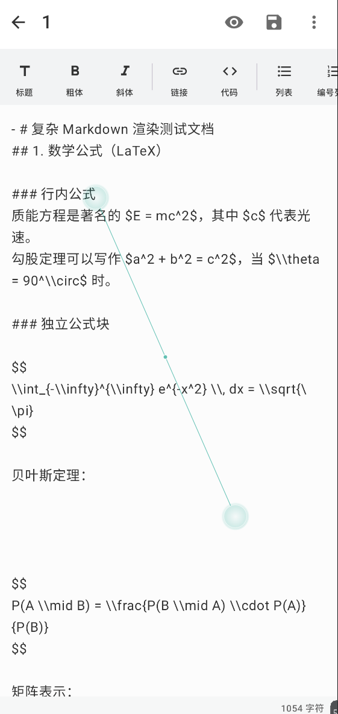
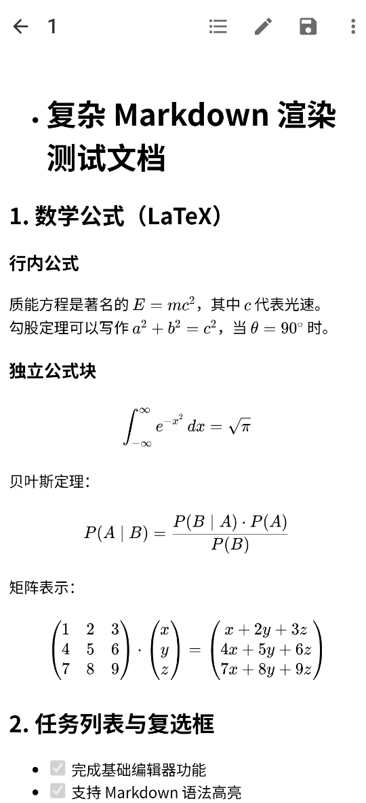
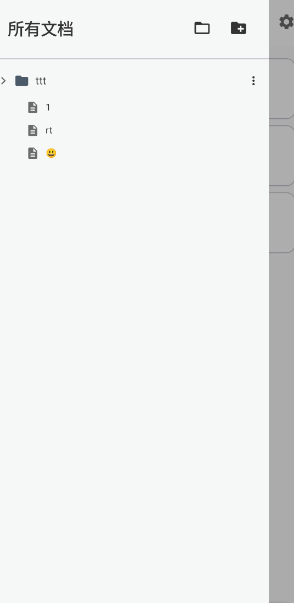
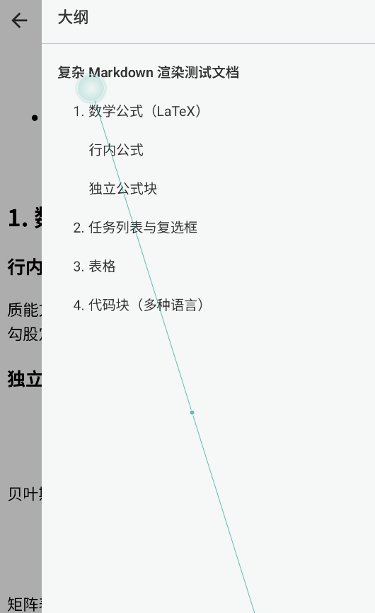
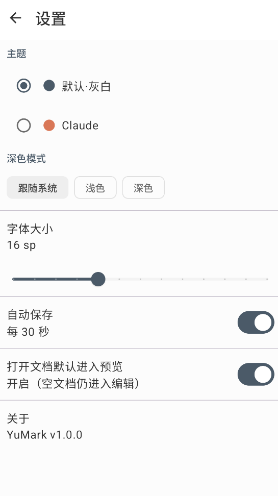

<p align="center">
  
</p>

<h1 align="center">YuMark</h1>

<p align="center">
  <strong>Typora 风格的 Android Markdown 编辑器</strong>
</p>

<p align="center">
  <a href="https://github.com/ban-code-art/YuMark/releases"></a>
  
  
  
  
</p>

<p align="center">
  使用 Jetpack Compose + Material 3 构建，追求简洁优雅的书写体验。
</p>

---

## 概述

YuMark 是一款面向 Android 平台的 Markdown 编辑器，灵感来自桌面端的 Typora。它提供实时渲染预览、文件夹工作区管理、多主题切换等功能，让你在手机上也能获得流畅的 Markdown 写作体验。

## 应用截图

<p align="center">
  
  
  
</p>

<p align="center">
  
  
  
</p>

| 截图 | 说明 |
|------|------|
| 文档列表 | 主界面，展示所有文档及搜索/排序功能 |
| 编辑模式 | Markdown 原文编辑，底部工具栏快捷插入 |
| 预览模式 | 实时渲染，支持 LaTeX 数学公式 |
| 文件树侧栏 | 左侧拉出工作区文件树结构 |
| 大纲导航 | 右侧拉出标题大纲，点击定位 |
| 设置页面 | 主题切换、深色模式、字体、自动保存 |

## 核心功能

### 编辑与预览

| 功能 | 说明 |
|------|------|
| **实时预览** | 打开文档默认进入渲染预览，空文档自动进入编辑模式 |
| **Markdown 工具栏** | 标题、粗体、斜体、链接、代码块、表格等快捷插入 |
| **自动保存** | 可配置的自动保存间隔，防止内容丢失 |
| **数学公式** | KaTeX 渲染，支持行内和块级公式 |
| **代码高亮** | Prism.js 驱动，支持多种编程语言 |
| **流程图** | Mermaid 图表渲染（延迟加载，不影响性能） |

### 文件管理

| 功能 | 说明 |
|------|------|
| **文件夹工作区** | 通过系统文件选择器打开任意文件夹，直接读写原文件（SAF 关联） |
| **文件树浏览** | 左侧栏显示工作区文件树结构 |
| **大纲导航** | 右侧拉出大纲目录，点击标题精确定位 |
| **全文搜索** | 按文件名或正文内容搜索，结果带匹配片段预览 |
| **多种排序** | 按名称、日期、字数等多维度排序 |

### 主题与外观

| 功能 | 说明 |
|------|------|
| **双主题** | 默认灰白（Typora 风格）与 Claude（米白 + 赤陶橙）两套主题 |
| **深色模式** | 每套主题均配深色色板，支持跟随系统 / 手动切换 |
| **字体调节** | 可自定义预览和编辑器字体大小 |

### 导出与分享

| 功能 | 说明 |
|------|------|
| **HTML 导出** | 导出为完整 HTML 文件并通过系统分享 |
| **PDF 导出** | 规划中 |

## 技术架构

```
┌──────────────────────────────────────────────────────┐
│                 Presentation Layer                     │
│         Jetpack Compose + ViewModel + Hilt            │
├──────────────────────────────────────────────────────┤
│                   Domain Layer                         │
│          UseCases + Models + Repository Interfaces     │
├──────────────────────────────────────────────────────┤
│                    Data Layer                          │
│        Room + DataStore + SAF + File I/O              │
└──────────────────────────────────────────────────────┘
```

### 技术栈

| 分类 | 技术 |
|------|------|
| **UI 框架** | Jetpack Compose + Material 3 |
| **架构模式** | Clean Architecture + MVVM |
| **依赖注入** | Hilt |
| **本地存储** | Room（文档元数据）+ DataStore（用户设置） |
| **文件访问** | SAF DocumentFile（外部工作区） |
| **Markdown 渲染** | WebView + marked.js |
| **数学公式** | KaTeX |
| **代码高亮** | Prism.js |
| **图表** | Mermaid |
| **异步处理** | Kotlin Coroutines + Flow |
| **序列化** | Kotlinx Serialization |
| **测试** | JUnit 5 + MockK + Truth + Turbine |

## 项目结构

```
app/src/main/java/com/yumark/app/
├── core/                    # 基础能力
│   ├── export/              # 文档导出（HTML）
│   └── webview/             # WebView 渲染引擎
├── data/                    # 数据层
│   ├── local/               # Room Database + DAO
│   ├── preferences/         # DataStore 设置存储
│   ├── repository/          # Repository 实现
│   └── workspace/           # SAF 工作区文件操作
├── domain/                  # 领域层
│   ├── model/               # 领域模型（Document, Folder）
│   ├── repository/          # Repository 接口
│   └── usecase/             # 业务用例
├── presentation/            # 表现层
│   ├── editor/              # 编辑器界面
│   ├── filelist/            # 文件列表界面
│   ├── navigation/          # 导航路由
│   ├── settings/            # 设置页面
│   ├── sidebar/             # 侧栏（文件树 + 大纲）
│   └── theme/               # Material 3 主题定义
└── di/                      # Hilt 依赖注入模块
```

## 快速开始

### 环境要求

- **JDK** 17 或更高版本
- **Android Studio** Hedgehog (2023.1.1) 或更高版本
- **Android SDK** compileSdk 34
- **设备/模拟器** minSdk 26（Android 8.0）

### 克隆与构建

```bash
# 克隆仓库
git clone https://github.com/ban-code-art/YuMark.git
cd YuMark

# 构建 Debug APK
./gradlew :app:assembleDebug

# 运行单元测试
./gradlew :app:testDebugUnitTest
```

### 产物路径

```
app/build/outputs/apk/debug/app-debug.apk
```

### 安装到设备

```bash
adb install app/build/outputs/apk/debug/app-debug.apk
```

## 构建变体

| 变体 | 说明 |
|------|------|
| **debug** | 开发版本，applicationId 后缀 `.debug`，未混淆 |
| **release** | 发布版本，启用代码混淆与资源压缩 |

## 开发指南

### 代码规范

- 遵循 [Kotlin Coding Conventions](https://kotlinlang.org/docs/coding-conventions.html)
- 优先使用 `val`，减少可变状态
- 使用 sealed class 建模 UI 状态
- Composable 函数保持小而专注

### 测试

```bash
# 单元测试
./gradlew :app:testDebugUnitTest

# 查看测试报告
# app/build/reports/tests/testDebugUnitTest/index.html
```

### 添加新功能

1. 在 `domain/` 定义模型和用例接口
2. 在 `data/` 实现数据访问
3. 在 `presentation/` 构建 UI
4. 在 `di/` 注册依赖绑定

## 路线图

- [ ] PDF 导出（Android Print API）
- [ ] 更多主题与自定义配色
- [ ] Markdown 扩展（脚注、任务列表）
- [ ] 文档历史版本
- [ ] 云同步（Google Drive）
- [ ] 平板分屏优化
- [ ] 插件系统

## 参与贡献

欢迎提交 Issue 和 Pull Request！详见 [CONTRIBUTING.md](CONTRIBUTING.md)。

### 贡献流程

1. Fork 本仓库
2. 创建功能分支：`git checkout -b feature/your-feature`
3. 提交更改并编写清晰的 commit message
4. 推送并发起 Pull Request

## 致谢

感谢以下开源项目：

- [Marked.js](https://marked.js.org/) — Markdown 解析
- [KaTeX](https://katex.org/) — 数学公式渲染
- [Prism.js](https://prismjs.com/) — 代码语法高亮
- [Mermaid](https://mermaid.js.org/) — 图表渲染
- [Jetpack Compose](https://developer.android.com/jetpack/compose) — 声明式 UI
- [Material 3](https://m3.material.io/) — 设计系统

## 许可证

本项目基于 [MIT License](LICENSE) 开源。

```
MIT License

Copyright (c) 2024 YuMark Contributors
```

---

<p align="center">
  用 ❤️ 和 Kotlin 构建
</p>
