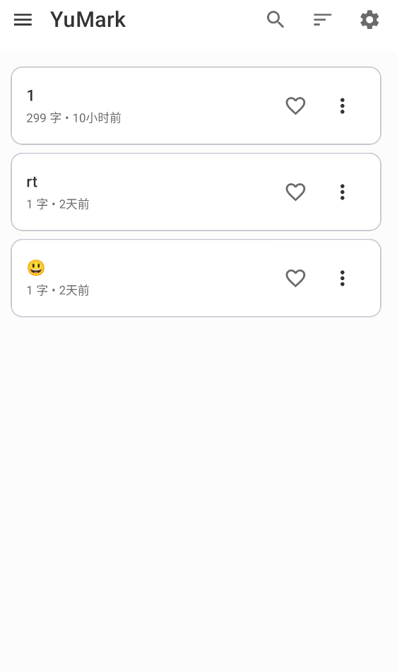
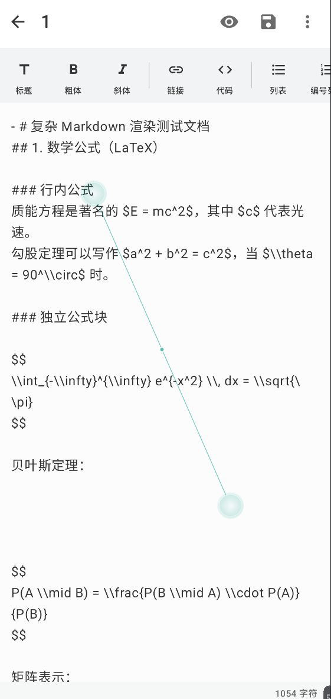
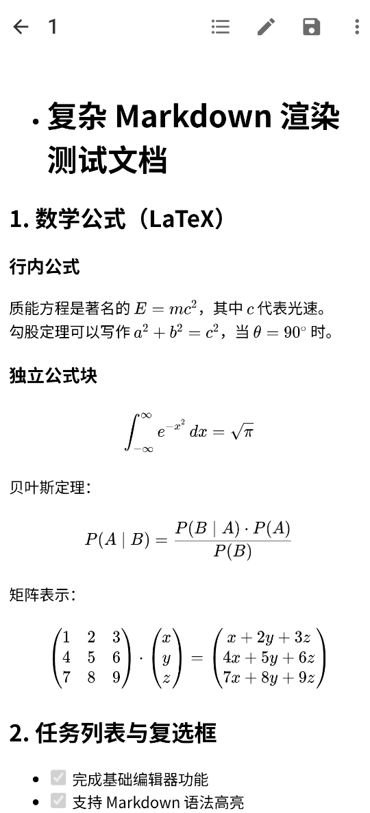
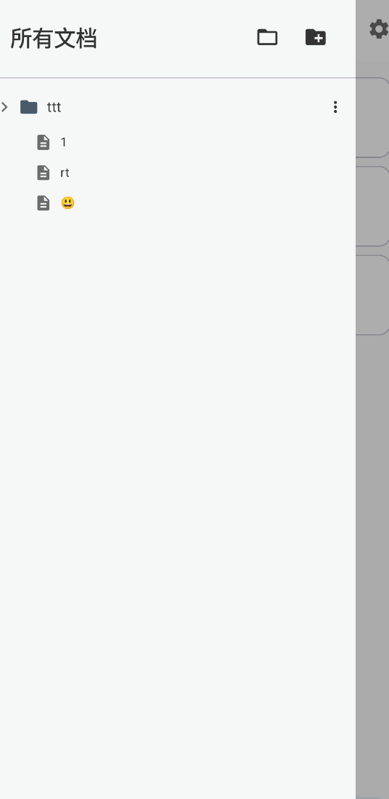
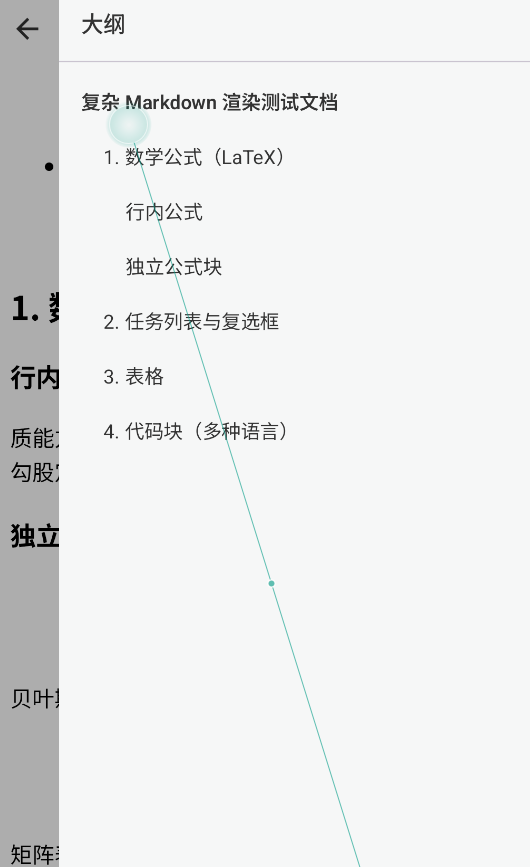
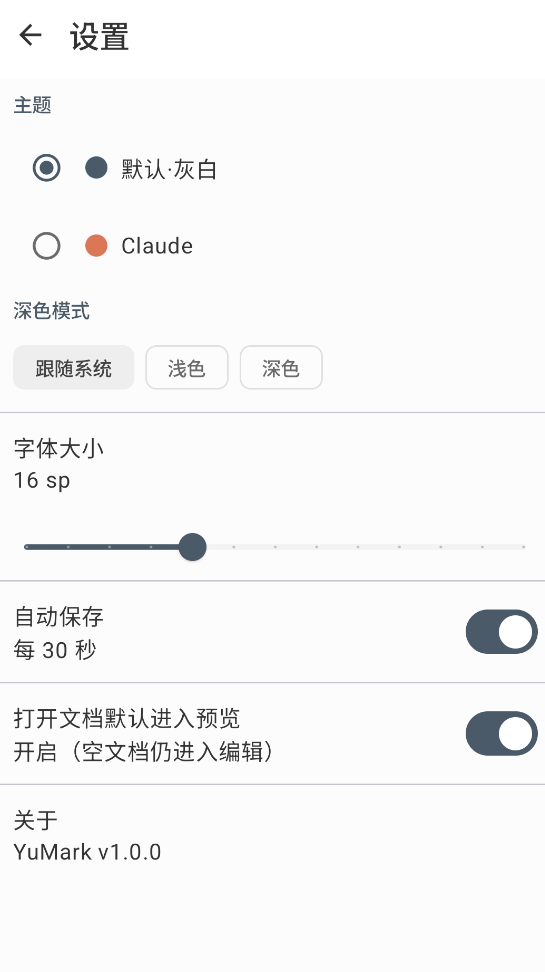
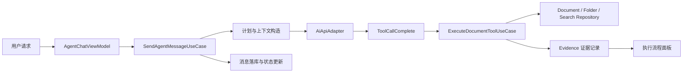
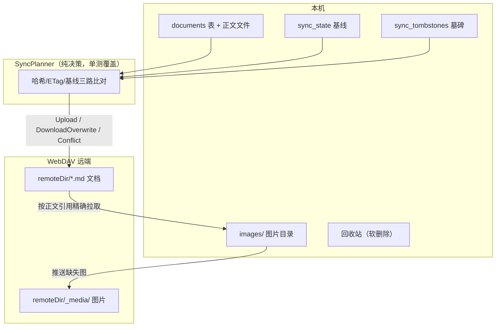
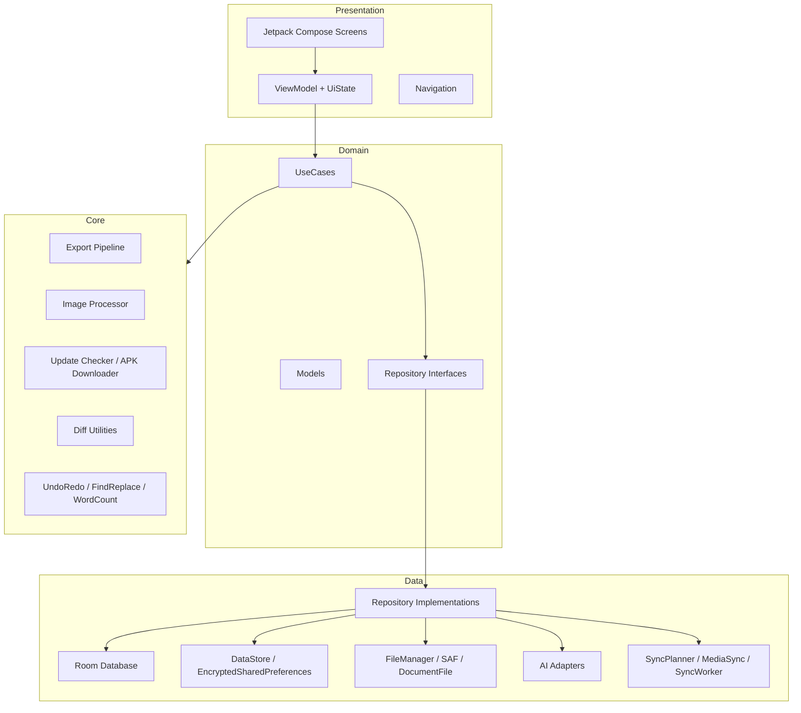

<p align="center">
  
</p>

<h1 align="center">YuMark</h1>

<p align="center">
  <strong>面向 Android 的本地优先 AI Native Markdown 工作台</strong>
</p>

<p align="center">
  从本地笔记、外部文件夹、实时预览，到多模型 AI 助手、Agent 文档自动化与 WebDAV 多端同步，<br>
  YuMark 希望把手机上的 Markdown 写作体验做得足够安静、强大、可信赖——数据始终属于你。
</p>

<p align="center">
  <a href="https://github.com/ban-code-art/YuMark/releases"></a>
  <a href="https://github.com/ban-code-art/YuMark/actions/workflows/android.yml"></a>
  
  
  
</p>

<p align="center">
  <a href="#功能全景">功能全景</a>
  ·
  <a href="#ai-与-agent">AI 与 Agent</a>
  ·
  <a href="#云同步">云同步</a>
  ·
  <a href="#技术架构">技术架构</a>
  ·
  <a href="#质量与测试">质量与测试</a>
  ·
  <a href="#安全与隐私">安全与隐私</a>
  ·
  <a href="#快速开始">快速开始</a>
</p>

---

## 项目定位

YuMark 是一款 Android Markdown 编辑器，也是一套围绕"移动端写作、知识管理、AI 协作"的完整实验场。

它不是单纯的文本输入框。YuMark 同时管理本地文档库、回收站、外部文件夹工作区、Markdown 渲染、WebDAV 多端同步、导入导出、主题设置、自动更新、AI 对话、Agent 执行流程和工具调用证据。核心目标是让用户在手机上完成从记录、整理、阅读、重写到自动化处理文档的完整闭环——并且**任何一次误操作都有回头路**。

| 方向 | YuMark 解决的问题 |
| --- | --- |
| 移动写作 | 接近桌面编辑器的沉浸式书写与预览体验，平板/折叠屏自适应 |
| 本地优先 | 正文、设置、对话、任务和附件都优先落在本机；零统计、零上报 |
| 数据安全 | 回收站兜底删除、原子写入、历史版本、迁移测试、冲突副本 |
| 多端同步 | WebDAV 双向同步文档与图片，删除传播带救援副本，后台定时增量 |
| AI 协作 | 普通聊天、选中文本快捷处理、Agent 文档工具调用（写操作需审批）和多模态输入 |
| 可维护工程 | Kotlin + Compose + 分层架构；1288 个单测、CI 质量门禁、detekt、签名发布流水线 |

## 下载与安装

最新版本：**v0.11**（versionCode 22）<br>
系统要求：Android 8.0+（minSdk 26）<br>
发布页：[YuMark Releases](https://github.com/ban-code-art/YuMark/releases)

| 资产 | 说明 |
| --- | --- |
| `app-release.apk` | 签名正式包，覆盖安装无需卸载旧版本 |
| SHA-256（v0.11） | `0e9b2fda6a098a7b42db842635c8a41ea627b50d125762b5d3ece298361c3478` |

> 应用内「检查更新」会对下载包做 **SHA-256 摘要 + 签名证书**双重校验，与发布说明不一致时拒绝安装。
> APK 不放入 git 源码历史，发布包统一通过 GitHub Release 管理。

## 应用截图

<p align="center">
  
  
  
</p>

<p align="center">
  
  
  
</p>

| 画面 | 说明 |
| --- | --- |
| 文档列表 | 本地文档库入口，支持搜索、排序、文件夹组织、回收站入口 |
| 编辑模式 | Markdown 原文编辑，底部工具栏快速插入常用语法 |
| 预览模式 | WebView 渲染 Markdown，支持公式、代码高亮、图表和图片 |
| 文件树侧栏 | 展示库内目录或外部工作区结构，适合长项目浏览 |
| 大纲导航 | 由渲染页回传标题结构，点击标题快速定位 |
| 设置页面 | 主题、字体、自动保存、图片压缩、默认目录、隐私政策与 AI 配置入口 |

## 功能全景

### 1. Markdown 写作与阅读

编辑器围绕"写得快、看得清、切换稳"设计。编辑态专注输入，预览态专注阅读，二者之间通过滚动比例同步和渲染就绪握手减少跳动。

| 能力 | 细节 |
| --- | --- |
| Markdown 原文编辑 | 支持标题、列表、引用、链接、代码块、表格等常用语法 |
| 快捷工具栏 | 底部 Markdown Toolbar 快速插入标题、加粗、斜体、链接、代码、表格等片段 |
| 实时渲染预览 | WebView 加载本地渲染模板，Base64 通道传递正文，降低转义问题 |
| 滚动同步 | 编辑态和预览态按比例保存与恢复滚动位置，长文档切换更稳定 |
| 大纲提取 | 渲染页扫描标题结构并回传，大纲支持点击定位 |
| 撤销 / 重做 | 光标随内容一起回滚；AI 改写、版本恢复可整步撤销 |
| 查找替换 | 编辑态查找替换栏，正则安全转义 |
| 自动保存 | 停手防抖 + 周期轮询 + 退出保存三重保障，写盘挂起期间的输入不丢失 |
| 外部更新热刷新 | 同步 / Agent / 外部流程修改文档后，编辑器自动采纳或提示冲突副本 |

### 2. 高级 Markdown 渲染

渲染不是简单把文本转 HTML，而是针对移动端 WebView 的分阶段处理管线。

| 渲染能力 | 实现方式 |
| --- | --- |
| GFM Markdown | `marked.js`，启用 `gfm` 和换行处理 |
| HTML 净化 | `DOMPurify` 收敛输出，方案白名单、事件属性剥离、缺失时 fail-closed 降级纯文本 |
| 数学公式 | `KaTeX`，解析前保护公式占位，避免下划线、反斜杠被错误解析 |
| 代码高亮 | `Prism.js`，渲染后对代码块执行高亮 |
| Mermaid 图表 | 延迟渲染，避免影响首屏体验 |
| 安全基线 | 渲染页 CSP：`connect-src 'none'`、禁 eval；加载远程模板失败有看门狗与重试 |
| 主题适配 | 渲染页底色与 Compose 主题同步，保留 WebView 硬件加速滚动性能 |

### 3. 文档库与回收站

应用内文档库使用 Room 保存元数据、正文落本地文件系统：保留文件级可迁移性，同时让搜索、排序、文件夹树有稳定的数据模型。**删除永远是两段式**。

| 能力 | 说明 |
| --- | --- |
| 本地文档库 | 标题、文件夹、字数、时间等元数据由 Room 管理，正文在私有目录 |
| 文件夹组织 | 文件夹树、移动、收藏、根目录高亮和目录级管理 |
| 全文搜索 | Room FTS4 全文索引 + 内存子串降级，命中按相关度排序 |
| 排序 | 名称、更新时间、创建时间、字数等多维排序 |
| **回收站** | 删除 = 移入回收站：恢复、彻底删除（二次确认）、清空、30 天到期自动清理；原文件夹已删则恢复到根目录，重名自动改名落座 |
| 历史版本 | 每文档 50 版 FIFO 快照，内容不变不重复记录 |
| 原子写入 | 临时文件 + fsync + rename + `.bak` 自愈，断电/被杀不留半截正文 |
| 数据迁移 | v1→v14 全链路显式迁移（无破坏性回退），迁移语句由契约测试逐字校验 + 真机测试 |

### 4. 云同步

WebDAV 双向同步围绕"宁可复活一篇，也不误删一篇"设计，所有删除都有兜底。

| 能力 | 说明 |
| --- | --- |
| 双向同步 | 文档正文 + 图片附件（`_media` 通道），哈希比对增量，未变化零传输 |
| 后台自动同步 | WorkManager 周期任务（6 小时）+ 启动静默增量同步 + 手动即时同步 |
| 冲突处理 | 内容哈希 + ETag 判双边修改；冲突时远端版本先存为本地冲突副本再上传本地 |
| 条件上传 | 强 ETag `If-Match` 防竞态覆盖；412 不退化，弱验证器过滤 |
| 删除传播 | 墓碑机制 + `sync_trash` 救援副本（100 份/64MiB，设置页可查看导出）；回收站删除在彻底删除时才传播 |
| 瞬时容错 | 429/5xx/网络错误指数退避重试 3 次；确定性失败（401/403/404）不重试并给可操作文案 |
| 状态可见 | 每轮同步的上传/下载/删除/冲突/失败计数，上次同步时间持久化 |

### 5. 外部工作区、导入与导出

| 能力 | 说明 |
| --- | --- |
| SAF 工作区 | 打开外部文件夹直接编辑真实 Markdown 文件；目录级批量查询扫描，支持会话恢复与默认目录 |
| 外部修改检测 | 保存前比对 `lastModified` 基线，外部应用改过的文件先备份为冲突副本再写入 |
| 文件夹导入 | 逐文件导入 + 图片镜像目录，失败计数、单张 25MB 上限 |
| 导出格式 | Markdown / HTML（内联本地图片 + CSP）/ PDF（分页渲染）/ Word（手写 OOXML，无 POI 依赖）/ 长图 PNG（16000px 上限） |
| 导出治理 | 导出目录有界保留（20 份 / 128MiB / 15 分钟分享宽限期） |

### 6. 更新检查与发布包

| 能力 | 说明 |
| --- | --- |
| 更新检查 | 启动静默检查 GitHub Releases（可在设置关闭），逐段数字比较版本 |
| APK 下载 | Ktor 流式下载，支持多个国内加速镜像 |
| 安全校验 | SHA-256 摘要（来自 GitHub API）+ 包名 + 签名证书指纹三重校验后经系统安装器安装 |
| Release 产物 | APK 以 GitHub Release Asset 发布，源码仓库不追踪 APK |

## AI 与 Agent

YuMark 的 AI 不是单一聊天窗口，而是拆成三层体验：普通对话、编辑器快捷 AI、Agent 文档自动化。所有 AI 相关操作都遵循同一底线：**密钥只存本机、写操作必须审批、不合适的内容绝不静默出境**（首次启用 AI 时有知情确认）。

### AI 模式矩阵

| 模式 | 适合场景 | 能力边界 |
| --- | --- | --- |
| 普通聊天 | 解释概念、生成草稿、讨论写作思路 | 不直接修改文档 |
| 快捷 AI | 对当前文档或选中文本提问、润色、改写 | 与编辑器上下文绑定 |
| Agent | 规划任务、读取文档、搜索项目、创建或编辑文档 | 可通过工具调用产生文档操作，写操作需逐行 diff 审批 |

### 支持的模型 Provider

| Provider | 用途 |
| --- | --- |
| OpenAI 官方 | 默认 OpenAI API 格式 |
| OpenAI Compatible | 兼容 DeepSeek、Ollama、本地 vLLM 等 OpenAI 风格接口 |
| Claude | Anthropic Claude API |
| Gemini | Google Gemini API，API key 使用请求头传递 |

API Key 使用 AndroidX Security Crypto（Keystore 主密钥 + AES256-GCM）存储，非敏感配置走 DataStore。AI 配置页支持 Provider、Base URL、模型名、温度/Token 上限、流式开关与联网搜索管理。

### Agent Runtime

Agent 把一次复杂请求拆成可观察、可终止、可审计的任务流。


```mermaid
flowchart LR
    U[用户请求] --> VM[AgentChatViewModel]
    VM --> S[SendAgentMessageUseCase]
    S --> P[计划与上下文构造]
    P --> A[AiApiAdapter]
    A --> TC[ToolCallComplete]
    TC --> E[ExecuteDocumentToolUseCase]
    E --> R[Document / Folder / Search Repository]
    E --> EV[Evidence 证据记录]
    EV --> UI[执行流程面板]
    S --> M[消息落库与状态更新]
```

| Agent 能力 | 说明 |
| --- | --- |
| 任务生命周期 | `EXECUTING`、`COMPLETED`、`FAILED`、`CANCELLED`、`BLOCKED` 等状态持久化，进程被杀后重启可收敛 |
| 写操作审批门 | 创建/编辑一律转为待审提议，逐行 diff 审阅；执行前校验基线哈希，过期提议拒绝 |
| 执行流程面板 | 展示步骤、状态、阻塞原因、最终摘要和工具调用痕迹，折叠状态持久化 |
| 工具调用累积 | 一轮响应中的多个工具调用累积处理，避免被后续调用覆盖 |
| 证据记录 | 每次工具调用保留来源工具、输入摘要和结果摘要 |
| 多模态附件 | Agent 支持最多 3 张图片附件，经压缩后传给视觉模型 |
| 知识检索 | RAG：本地分块 + 向量/关键词混合检索，embedding 端点可指向本地 Ollama 实现全本地化 |

### 文档工具

Agent 使用结构化工具访问文档上下文。工具 schema 与解析逻辑由测试守护，减少模型输出字段漂移造成的执行错误。

| 工具方向 | 典型能力 |
| --- | --- |
| 读取文档 | 按文档 ID 读取正文，为回答和编辑提供上下文 |
| 搜索项目 | 在当前文档库中搜索关键词，返回候选文档 |
| 知识检索 | 基于本地 RAG 索引的语义搜索（`search_knowledge`） |
| 创建文档 | 根据模型输出创建新文档 |
| 编辑文档 | 对当前或指定文档生成新内容，并进入操作确认流程 |
| 证据关联 | 每次工具调用保留来源工具、输入摘要和结果摘要 |

## 云同步架构


```mermaid
flowchart TB
    subgraph Local["本机"]
        Docs["documents 表 + 正文文件"]
        Images["images/ 图片目录"]
        Trash["回收站（软删除）"]
        State["sync_state 基线"]
        Tomb["sync_tombstones 墓碑"]
    end

    subgraph Planner["SyncPlanner（纯决策，单测覆盖）"]
        Diff["哈希/ETag/基线三路比对"]
    end

    subgraph Remote["WebDAV 远端"]
        MD["remoteDir/*.md 文档"]
        Media["remoteDir/_media/ 图片"]
    end

    Docs --> Diff
    State --> Diff
    Tomb --> Diff
    Diff -->|Upload / DownloadOverwrite / Conflict| MD
    Images -->|推送缺失图| Media
    MD -->|按正文引用精确拉取| Images
```

- **软删除不碰远端**：文档进回收站时远端文件原样保留（孤儿登记）；彻底删除才立墓碑推删。
- **远端删除不硬删本地**：传播到本机时先进回收站，可从应用内恢复。
- **媒体通道独立**：文档同步只认 `.md`，图片走 `_media/` 子目录互不干扰。

## 技术架构

YuMark 采用 Clean Architecture + MVVM。代码按表现层、领域层、数据层和基础设施能力拆分，核心业务通过 UseCase 组织，Repository 接口定义在 domain，具体实现放在 data。


```mermaid
flowchart TB
    subgraph Presentation["Presentation"]
        Compose["Jetpack Compose Screens"]
        VM["ViewModel + UiState"]
        Nav["Navigation"]
    end

    subgraph Domain["Domain"]
        Model["Models"]
        UseCase["UseCases"]
        RepoContract["Repository Interfaces"]
    end

    subgraph Data["Data"]
        RepoImpl["Repository Implementations"]
        Room["Room Database"]
        Store["DataStore / EncryptedSharedPreferences"]
        FileIO["FileManager / SAF / DocumentFile"]
        AI["AI Adapters"]
        Sync["SyncPlanner / MediaSync / SyncWorker"]
    end

    subgraph Core["Core"]
        Export["Export Pipeline"]
        Image["Image Processor"]
        Update["Update Checker / APK Downloader"]
        Diff["Diff Utilities"]
        Text["UndoRedo / FindReplace / WordCount"]
    end

    Compose --> VM
    VM --> UseCase
    UseCase --> RepoContract
    RepoContract --> RepoImpl
    RepoImpl --> Room
    RepoImpl --> Store
    RepoImpl --> FileIO
    RepoImpl --> AI
    RepoImpl --> Sync
    UseCase --> Core
```

### 分层职责

| 层级 | 主要内容 | 代表文件 |
| --- | --- | --- |
| Presentation | 页面、组件、状态收集、用户交互 | `EditorScreen.kt`、`FileListScreen.kt`、`TrashScreen.kt` |
| Domain | 领域模型、Repository 接口、UseCase | `Document.kt`、`AgentUseCases.kt`、`ExportDocumentUseCase.kt` |
| Data | Room、DataStore、AI Adapter、同步决策与执行、Repository 实现 | `AppDatabase.kt`、`SyncPlanner.kt`、`OpenAiAdapter.kt` |
| Core | 导出、图片处理、更新下载、diff、文本算法、校验 | `HtmlExporter.kt`、`ApkDownloader.kt`、`UndoRedoStack.kt` |
| DI | 依赖注入模块 | `DatabaseModule.kt`、`RepositoryModule.kt`、`NetworkModule.kt` |

## 技术栈

| 分类 | 技术 |
| --- | --- |
| 语言 | Kotlin（AGP 9 内置 Kotlin，KSP2） |
| 构建 | Gradle Wrapper + Android Gradle Plugin 9.4.0，compileSdk 37 / targetSdk 36 / minSdk 26 |
| UI | Jetpack Compose、Material 3（自适应布局）、Navigation Compose |
| 状态 | ViewModel、StateFlow、Lifecycle Runtime Compose |
| 异步 | Kotlin Coroutines、Flow |
| 依赖注入 | Hilt 2.60.1 |
| 数据库 | Room 2.8.4（FTS4 全文索引，schema 全量导出） |
| 后台任务 | WorkManager 2.10（周期同步） |
| 设置存储 | DataStore Preferences |
| 敏感配置 | AndroidX Security Crypto（Keystore 主密钥 + AES256-GCM） |
| 文件系统 | Android SAF、DocumentFile、应用私有目录 |
| 网络 | Ktor Client（Android/CIO 双引擎）、Content Negotiation、Kotlinx Serialization |
| Markdown 预览 | WebView、marked.js、KaTeX、Prism.js、Mermaid、DOMPurify |
| Markdown 导出 | CommonMark、GFM Tables、Strikethrough、Task List Items |
| 图片 | Coil Compose、EXIF 转正、两步下采样 |
| 静态分析 | Android Lint（MissingTranslation error 级）、detekt（默认规则集 + 存量基线） |
| 测试 | JUnit 5.14、MockK、Truth、Turbine、Coroutines Test、Compose UI Test、Room Migration Test |

## 项目结构

```text
YuMark/
├── app/
│   ├── build.gradle.kts                 # 签名外置、R8、detekt 配置
│   ├── schemas/                         # Room schema（v1~v14 全量入库，迁移测试前提）
│   ├── proguard-rules.pro
│   └── src/
│       ├── main/
│       │   ├── assets/                  # Markdown 渲染模板与 JS/CSS 资源（哈希校验）
│       │   ├── java/com/yumark/app/
│       │   │   ├── core/                # 导出、图片、更新、文本算法、安全、同步辅助
│       │   │   ├── data/
│       │   │   │   ├── ai/              # 适配器、RAG、记忆、联网搜索
│       │   │   │   ├── local/           # Room（DB/DAO/Entity/Migration）、DataStore、文件
│       │   │   │   ├── remote/          # WebDAV 客户端与更新检查
│       │   │   │   ├── repository/      # Repository 实现
│       │   │   │   └── sync/            # SyncPlanner / MediaSync / SyncWorker
│       │   │   ├── di/                  # Hilt 模块
│       │   │   ├── domain/              # Model、Repository 接口、UseCase
│       │   │   └── presentation/        # 编辑器、文件列表、回收站、AI、设置、导航
│       │   └── res/xml/                 # 备份规则、FileProvider、网络安全配置
│       ├── androidTest/                 # 迁移真机测试、冒烟、Compose UI 用例
│       └── test/                        # 1288 个 JVM 单元测试
├── config/detekt-baseline.xml           # 静态分析存量基线
├── docs/                                # 设计文档与截图资源
├── gradle/libs.versions.toml            # 版本集中管理
├── scripts/                             # 字符串一致性 / WCAG 对比度 / lint 汇总工具
├── .github/workflows/                   # android.yml（CI 门禁）+ release.yml（签名发布）
├── CHANGELOG.md / PRIVACY.md / HOW_TO_RELEASE.md
└── README.md
```

### 关键模块速览

| 模块 | 说明 |
| --- | --- |
| `presentation/editor` | 编辑器主界面、渲染 WebView 管理、AI 快捷入口、外部变更感知 |
| `presentation/trash` | 回收站（恢复 / 彻底删除 / 清空 / 到期清理） |
| `presentation/ai` | AI 聊天、Agent 面板、对话列表、diff 审批卡片 |
| `domain/usecase/ai` | AI 配置、聊天发送、Agent runtime、文档工具和搜索排序 |
| `data/sync` | 同步决策（SyncPlanner）、媒体通道（MediaSync）、后台任务（SyncWorker） |
| `data/ai/adapters` | OpenAI、Claude、Gemini、OpenAI Compatible 的协议适配 |
| `data/local/db` | Room database、DAO、Entity、v1→v14 迁移 |
| `data/local/prefs` | Settings、Workspace、AI Config（加密）、Agent UI 偏好 |
| `core/export` | CommonMark HTML / PDF / DOCX / 长图导出管线 |
| `core/update` | 更新检查、APK 下载、摘要与签名校验 |

## 质量与测试

测试覆盖领域逻辑、AI 工具调用、Agent 状态机、同步决策、数据映射、迁移、图片处理和 ViewModel 行为。

| 测试方向 | 说明 |
| --- | --- |
| 同步决策 | SyncPlanner 全分支单测（上传/下载/冲突/墓碑/孤儿登记），RetryPolicy 纯逻辑测试 |
| 回收站 | 软删除/恢复/彻底删除/到期清理/名字落座，FTS 与 RAG 隔离 |
| 媒体同步 | 推送去重与上限、按引用拉取、路径穿越拒绝 |
| 迁移 | JVM 侧契约测试（逐字比对导出 schema）+ 真机 MigrationTestHelper |
| AI Adapter | 多模态消息、工具调用格式、流式重试、取消异常 |
| Agent Runtime | 任务规划、工具执行、阻塞状态、终态写入、审批门 |
| 编辑器 | 保存竞态（写盘挂起闸门模拟）、外部变更采纳/冲突副本、导出状态 |
| Compose UI | 回收站交互用例（首批，随 CI instrumented job 跑在模拟器上） |

CI（`.github/workflows/android.yml`）在每次 PR/push 上执行：**JS 供应链哈希校验 → 单测 → Lint → assembleDebug → androidTest 编译 → R8 混淆链 → detekt → Room schema 守卫**，main 分支额外跑 KVM 模拟器仪器测试。

常用验证命令：

```bash
# 完整检查：lint + unit test + debug/release check
./gradlew :app:check --continue

# Debug 单元测试
./gradlew :app:testDebugUnitTest

# 静态分析
./gradlew :app:detekt

# Release 构建
./gradlew :app:assembleRelease
```

## 安全与隐私

数据安全是这个项目的第一优先级，详细立场见 [PRIVACY.md](PRIVACY.md)。要点：

| 项目 | 策略 |
| --- | --- |
| 数据归属 | 笔记、图片、配置只存本机；零统计 SDK、零上报、零广告 |
| 凭据存储 | API Key / WebDAV 密码走 Android Keystore 主密钥保护的 AES256-GCM 加密存储 |
| 云备份 | 密文文件排除在 Auto Backup 之外（主密钥绑定设备，恢复端 fail-closed） |
| 网络策略 | `networkSecurityConfig` 显式禁明文；仅有的自动网络请求是 GitHub 版本检查（可关） |
| 数据出境 | 仅两处且都由用户发起：WebDAV 同步（自己的服务器）、AI 功能（自己配置的端点，首次启用有知情确认） |
| 崩溃日志 | 本地有界留存（20 条/512KB）、零上传、导出前自动脱敏密钥 |
| 渲染安全 | CSP + DOMPurify + 桥输入上限 + 导航封锁 + 用后即拆 interface |
| 删除安全 | 回收站兜底 + 墓碑 + 救援副本，任何删除都有恢复路径或审计痕迹 |
| 签名与发布 | 签名配置外置本地；CI 不持有签名材料；release.yml 经 Secrets 注入构建签名包 |

> 安全提醒：旧 release keystore 曾发生过泄露风险，正式对外发布前应轮换全新 keystore。仓库曾被 fork 或 clone 的情况下，历史清理不能撤销外部副本，密钥轮换仍然必要。

## 快速开始

### 环境要求

| 依赖 | 版本 |
| --- | --- |
| JDK | 17+ |
| Android Studio | 最新稳定版（compileSdk 37 需要） |
| Android SDK | compileSdk 37，targetSdk 36 |
| 最低系统 | Android 8.0（minSdk 26） |

### 克隆与构建

```bash
git clone https://github.com/ban-code-art/YuMark.git
cd YuMark

# 补齐/校验渲染 JS 库（供应链哈希校验）
bash download-js-libs.sh

# Debug 构建
./gradlew :app:assembleDebug

# 单元测试
./gradlew :app:testDebugUnitTest
```

Release 构建需要本地签名配置（模板见 `keystore.properties.example`，真实密钥文件不入库）：

```properties
storeFile=../release.keystore
storePassword=
keyAlias=
keyPassword=
```

```bash
./gradlew :app:assembleRelease
# 产物：app/build/outputs/apk/release/app-release.apk
```

## 发布流程

发布由 `.github/workflows/release.yml` 自动化：打 `v*` 标签 → CI 构建签名 APK → 计算 SHA-256 → 创建 GitHub Release 并附产物。签名材料经仓库 Secrets 注入，任何一步失败都不会产出半成品发布。完整 runbook 见 [HOW_TO_RELEASE.md](HOW_TO_RELEASE.md)。

## 路线图

### 产品能力

- [x] 本地 Markdown 文档库 + 回收站（软删除 / 恢复 / 彻底删除 / 30 天到期清理）
- [x] 外部 SAF 工作区（含外部修改冲突检测）
- [x] Markdown 实时预览（KaTeX、Prism、Mermaid、DOMPurify 净化）
- [x] AI 聊天与编辑器快捷 AI、Agent 文档工具调用（审批门）
- [x] 多模型 Provider、图片附件与多模态输入、RAG 知识检索
- [x] Markdown / HTML / PDF / Word / 长图导出
- [x] 文档历史版本
- [x] WebDAV 文档与图片同步、后台自动同步、同步删除救援
- [x] 平板与折叠屏布局优化
- [x] 隐私政策与 AI 数据出境知情确认

### 技术治理

- [x] Room FTS 全文搜索（迁移 10 → 11 + 惰性回填）
- [x] networkSecurityConfig（显式禁明文）
- [x] backup 策略收敛（排除密文与本地诊断产物）
- [x] 签名发布流水线（release.yml）+ detekt 门禁 + Room schema 守卫
- [x] 回收站迁移链 v13→v14（契约测试 + 真机迁移测试）
- [ ] Markdown HTML sanitizer（应用内已有 DOMPurify + CSP；导出 HTML 原生 HTML 透传仍在）
- [ ] 文件夹层级同步与媒体孤儿清理（P2 专项）
- [ ] Agent 架构拆分与 domain/data 依赖方向清理

## 贡献

欢迎提交 Issue、Pull Request 或设计建议。提交前请确认 `./gradlew :app:testDebugUnitTest :app:detekt :app:lintDebug` 全绿（CI 会以相同标准把关）。更完整的贡献说明见 [CONTRIBUTING.md](CONTRIBUTING.md)。

## 许可证

MIT License - 详见 [LICENSE](LICENSE)。

---

**下载**：[GitHub Releases](https://github.com/ban-code-art/YuMark/releases) · **更新说明**：[CHANGELOG.md](CHANGELOG.md) · **隐私**：[PRIVACY.md](PRIVACY.md) · **问题反馈**：[GitHub Issues](https://github.com/ban-code-art/YuMark/issues)
